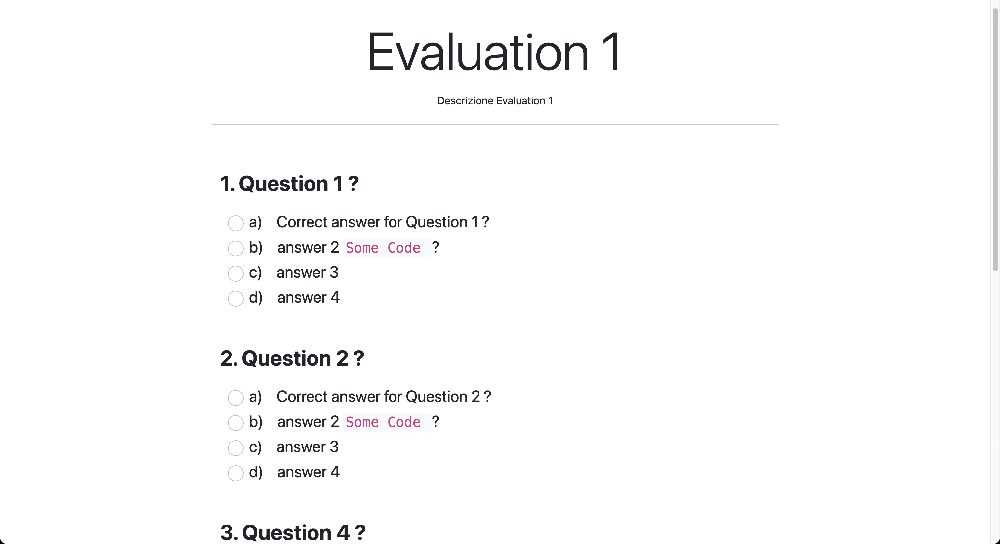

# INFOQUIZ

## Indice
- [Descrizione del progetto](#descrizione)
  - [Versione corrente](#versione-corrente-100)
- [Stack tecnologico](#stack-tecnologico)
- [Prerequisiti di sistema](#prerequisiti-di-sistema)
- [Esecuzione dell'applicazione](#eseguire-lapplicazione)
  - [Console H2 (Database)](#console-h2-database)
  - [Generazione file JAR](#generazione-file-jar)
- [Struttura del progetto](#struttura-del-progetto)
- [Screenshots](#Screenshots)
- [Esempi di utilizzo](#esempi-di-utilizzo)
- [Test e Qualità del Codice](#test-e-qualità-del-codice)
- [Deployment](#deployment)
- [Contribuire al progetto](#contribuire-al-progetto)
  - [Segnalazioni](#segnalazioni)
  - [Contributori](#contributori)
- [Autore](#autore)
- [Contatti e Supporto](#contatti-e-supporto)
- [Licenza](#licenza)

## Descrizione

### Versione corrente: 1.0.0

InfoQuiz è una webapp di quiz a punteggio progettato per valutare le conoscenze degli studenti.

InfoQuiz è, nella sua versione attuale, una piccola demo sperimentale pensata per favorire la collaborazione open source tra alcune classi di sviluppo software (ma non solo). Questo progetto offre agli studenti l'opportunità di applicare le loro conoscenze pratiche in un ambiente reale di sviluppo, stimolando la creatività e il lavoro di squadra.

Siamo ancora nelle fasi iniziali dello sviluppo e ci sono molte idee entusiasmanti da implementare per migliorare e ampliare le funzionalità esistenti. Invitiamo chiunque sia interessato a contribuire con idee innovative o a partecipare allo sviluppo per rendere InfoQuiz una piattaforma ancora più completa e coinvolgente.

Il sistema consente agli utenti di selezionare un test, rispondere alle domande e visualizzare i risultati alla fine del quiz. 
Le domande del quiz vengono randomizzate.

La logica del punteggio include l'assegnazione di bonus per le risposte corrette, la detrazione di punti per le risposte errate e nessuna penalità per risposte non date.

I risultati del quiz vengono memorizzati nel database per una successiva analisi. Il progetto è configurabile tramite file di proprietà, con la possibilità di impostare parametri come i punti bonus e i punti di penalità.

## Stack tecnologico
- Java 21 / Spring 3
- JUnit
- Maven
- Thymeleaf
- Bootstrap 5
- H2 Database
- Git / Github

## Prerequisiti di sistema
Per eseguire l'applicazione senza utilizzare un IDE (non in modalità "Java dev" 🙂), è necessaria l'installazione di Java sulla propria macchina. [La versione raccomanda è la 21](https://www.oracle.com/java/technologies/javase/jdk21-archive-downloads.html)

Per controllare la versione di Java installata sulla propria macchina, eseguire questo comando da command line:
```
java -version
```

# Eseguire l'applicazione
È inclusa una cartella ```startup_scripts``` con uno script di avvio per semplificare l'esecuzione dell'applicazione.
Questa configurazione consente di eseguire l'applicazione senza necessità di Maven.

Da sistema Windows:
```
cd startup_scripts
start.bat
```

Da sistema Linux:
```
cd startup_scripts
./start.sh
```

Aprire un browser web e navigare all'indirizzo http://localhost:8080 per accedere all'applicazione InfoQuiz.

### Console H2 (Database)
InfoQuiz utilizza H2 come database in-memory per memorizzare temporaneamente i dati durante l'esecuzione dell'applicazione. Per visualizzare e gestire il database in tempo reale, è possibile accedere alla console H2. Una volta avviata l'applicazione, apri un browser e vai all'indirizzo http://localhost:8080/h2-console. Usa l'URL di connessione jdbc:h2:mem:infoquiz e il nome utente che trovi nel file di configurazione per accedere alla console. Qui potrai visualizzare le tabelle, eseguire query SQL e gestire i dati nel database.

### Generazione file JAR
Il file JAR eseguibile viene generato durante il processo di build di Maven e si trova nella cartella `dist` del progetto. Questo file contiene l'intera applicazione ed è configurato per essere eseguibile direttamente eseguendo gli script di cui sopra. 

Per generare il file JAR, eseguire il seguente comando dalla directory principale del progetto:
`./mvnw clean package`

# Struttura del progetto
Il progetto InfoQuiz è organizzato nelle seguenti cartelle e file principali:

- **`src/main/java`**: Contiene il codice sorgente Java dell'applicazione.
  - **`com.davidefella.infoquiz`**: Package principale dell'applicazione.
    - **`controller`**: Include i controller Spring per gestire le richieste HTTP.
    - **`model`**: Contiene le classi di modello, divise in `persistence` per le entità JPA e `web` per i DTO utilizzati nelle interazioni web.
    - **`repository`**: Contiene le interfacce dei repository JPA per l'accesso al database.
    - **`service`**: Include la logica di business dell'applicazione.
    - **`utility`**: Contiene classi di utilità e configurazioni.

- **`src/main/resources`**: Contiene risorse statiche e file di configurazione.
  - **`templates`**: Contiene i file HTML Thymeleaf per il rendering delle viste.
  - **`static`**: Include file statici come CSS e JavaScript.
  - **`application.properties`**: File di configurazione per Spring Boot.

- **`src/test/java`**: Contiene i test unitari e di integrazione dell'applicazione.

- **`dist`**: Cartella in cui viene generato il file JAR eseguibile.

- **`startup_scripts`**: Contiene script di avvio per semplificare l'esecuzione dell'applicazione.
  - **`start.sh`**: Script di avvio per sistemi Linux.
  - **`start.bat`**: Script di avvio per sistemi Windows.

- **`pom.xml`**: File di configurazione Maven per la gestione delle dipendenze e la configurazione del build.

# Roadmap
Per vedere quali attività sono attualmente in lavorazione e quali sono pianificate per il futuro, visita la sezione [Projects](https://github.com/tuo-nome-utente/infoquiz/projects) del nostro repository su GitHub. Qui troverai una lista aggiornata delle task aperte, in lavorazione e completate, insieme a dettagli sulle priorità e sugli obiettivi a lungo termine del progetto.

Siamo sempre alla ricerca di feedback e contributi da parte della comunità, quindi se hai idee o suggerimenti su come migliorare InfoQuiz, sentiti libero di partecipare alle discussioni o creare una nuova issue.

Grazie!

# Esempi di utilizzo
Una volta che l'applicazione è in esecuzione, puoi iniziare a interagire con essa tramite un browser web. 
Ecco un esempio passo-passo su come utilizzare l'applicazione per completare un quiz:

1. **Accesso all'applicazione**
  - Apri un browser web e naviga all'indirizzo [http://localhost:8080](http://localhost:8080).
  - Verrai reindirizzato alla pagina iniziale dove potrai inserire il tuo nome e selezionare un quiz da completare.

2. **Selezione del Quiz**
  - Nella pagina iniziale, inserisci il tuo nome e cognome nei campi appropriati.
  - Scegli un quiz dal menu a tendina dei quiz disponibili.
  - Fai clic sul pulsante "Inizia" per iniziare il quiz.

3. **Completamento del Quiz**
  - Rispondi alle domande del quiz selezionando una risposta per ogni domanda visualizzata.
  - Le domande sono randomizzate per ogni tentativo

4. **Consegna del Quiz**
  - Una volta completato il quiz, fai clic sul pulsante "Consegna" per inviare le tue risposte.
  - Verrai reindirizzato a una pagina di ringraziamento che mostra i tuoi risultati.

5. **Visualizzazione dei Risultati**
  - La pagina dei risultati mostrerà il tuo punteggio finale e il numero di risposte corrette, errate e non date.
  - Se lo desideri, puoi tornare alla home page e completare un altro quiz.
  - 
6. **Nota sui Dati**
  - Al momento i risultati del quiz vengono memorizzati nel database H2 integrato, configurato in modalità in-memory.
    In questa modalità, i dati sono memorizzati solo nella RAM e vengono persi quando l'applicazione viene chiusa o riavviata.

Questa guida ti offre una panoramica di base su come interagire con InfoQuiz. Se incontri problemi o hai suggerimenti per migliorare l'applicazione, non esitare a segnalare un issue o contribuire con una pull request!

Screenshot dell'Applicazione

Di seguito sono mostrati alcuni screenshot dell'applicazione InfoQuiz che illustrano le funzionalità principali e l'interfaccia utente.

# Screenshots
## Pagina Iniziale


La pagina iniziale consente agli utenti di inserire il proprio nome e selezionare un quiz da completare.

## Pagina del Quiz



Durante il quiz, le domande vengono presentate in modo randomizzato. Gli utenti possono selezionare le risposte e procedere attraverso il quiz.

## Risultati del Quiz


Una volta completato il quiz, la pagina dei risultati mostra il punteggio totale e il numero di risposte corrette, errate e non date.

## Console H2


L'accesso alla console H2 consente di visualizzare e gestire il database in tempo reale durante l'esecuzione dell'applicazione.

---

# Test e Qualità del Codice

## Test

Per la verifica del corretto funzionamento del codice utilizziamo **JUnit**. 

- **Test Unitari**: Sono scritti per verificare il corretto funzionamento di singole unità di codice, come metodi o classi.
- **Test di Integrazione**: Assicurano che le diverse parti del sistema funzionino insieme come previsto.

## Qualità del Codice

Per monitorare la qualità del codice e identificare possibili problemi, utilizziamo **SonarQube Community Edition**. SonarQube esegue analisi statiche del codice per rilevare bug, code smells, vulnerabilità di sicurezza e problemi di stile.

# Deployment
Attualmente, l'applicazione InfoQuiz è progettata per essere eseguita in locale, avviandola tramite un IDE come IntelliJ IDEA o utilizzando Java da terminale, grazie agli script di avvio inclusi nel progetto.

# Contribuire al progetto

Ecco alcuni modi in cui puoi aiutarci, anche da non dev:
- Design e/o sviluppo di nuove funzionalità
- Test
- Documentazione
- UI/UX 
- Bux Fixing
- Varie ed eventuali
- Social Media

Non esitare a fare un fork del repository e a inviare una pull request con le tue modifiche. Grazie per il tuo supporto e contributo al progetto!

## Segnalazioni
Le segnalazioni sono super importanti per questo progetto. Le idee sono preziose e possono aiutare altri a contribuire.

 - I problemi mostrano dove il progetto ha bisogno di miglioramenti.
 - Fare domande aiuta i collaboratori a migliorare l'esperienza utente.

## Contributori

# Autore
- Davide Fella (https://omnes.one/davidefella)

# Contatti e Supporto
Per qualsiasi domanda, feedback o richiesta di supporto riguardo al progetto InfoQuiz, puoi utilizzare gli strumenti di GitHub, come le [Issues](https://github.com/tuo-nome-utente/infoquiz/issues) per segnalare bug o suggerire nuove funzionalità.

Sto valutando la creazione di un server Discord per facilitare la comunicazione in tempo reale e costruire una comunità intorno al progetto. Nel frattempo, sentiti libero di utilizzare i canali GitHub per rimanere in contatto.

Grazie per il tuo interesse e supporto!

# Licenza
Questo progetto è sotto licenza MIT, puoi consultare il file [qui](./LICENSE).